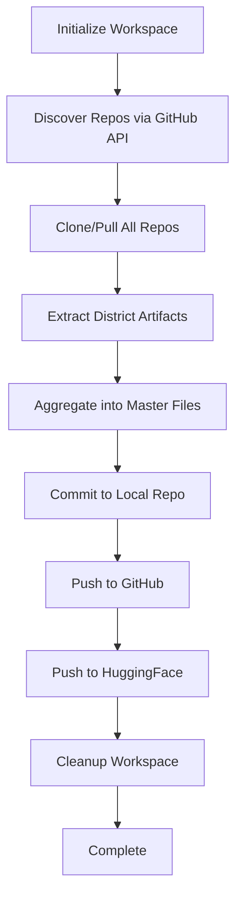

# 🛡️ GLOBAL WELD: Multi-Repository Synchronization Guide

**Citadel Architect v25.0.OMNI+ - Sovereign Systems Overseer**

## Overview

The **Global Weld** is a comprehensive synchronization engine that:

1. **Discovers** all repositories under `DJ-Goana-Coding` organization
2. **Clones/Pulls** each repository to a temporary workspace
3. **Extracts** District artifacts (`TREE.md`, `INVENTORY.json`, `SCAFFOLD.md`)
4. **Aggregates** into unified `master_inventory.json` and `master_intelligence_map.txt`
5. **Commits** consolidated artifacts to `mapping-and-inventory` repo
6. **Pushes** to both GitHub and HuggingFace Space

---

## Authority Hierarchy

```
Cloud Hubs (HF L4) > GitHub > GDrive Metadata > Local Nodes
```

**Protocol:** Pull-Over-Push (L4 Vacuum ingestion priority)

---

## Quick Start

### Option 1: Local Execution (Termux/Laptop)

```bash
# Set credentials (optional - uses public repos if not set)
export GITHUB_TOKEN="ghp_your_token_here"
export HF_TOKEN="hf_your_token_here"

# Run the sync
cd /path/to/mapping-and-inventory
./global_sync.sh
```

### Option 2: GitHub Actions (Automated)

The script is designed to run in GitHub Actions workflows with secrets:

```yaml
- name: Global Weld Sync
  env:
    GITHUB_TOKEN: ${{ secrets.GITHUB_TOKEN }}
    HF_TOKEN: ${{ secrets.HF_TOKEN }}
  run: |
    ./global_sync.sh
```

### Option 3: HuggingFace Space (L4 Vacuum)

Deploy as a scheduled job on HF Space with environment variables:
- `GITHUB_TOKEN` - For repo access
- `HF_TOKEN` - For Space sync

---

## Configuration

### Environment Variables

| Variable | Required | Description |
|----------|----------|-------------|
| `GITHUB_TOKEN` | Optional | GitHub PAT for private repo access & API rate limits |
| `HF_TOKEN` | Optional | HuggingFace token for Space sync (requires Write permission) |
| `KEEP_WORKSPACE` | Optional | Set to `true` to preserve `/tmp/citadel_sync_workspace` |

### Workspace Structure

```
/tmp/citadel_sync_workspace/
├── repos/                          # Cloned repositories
│   ├── ARK_CORE/
│   ├── TIA-ARCHITECT-CORE/
│   ├── tias-citadel/
│   └── ...
├── artifacts/                      # Extracted District artifacts
│   ├── ARK_CORE/
│   │   ├── Districts/D01_COMMAND_INPUT/
│   │   │   ├── TREE.md
│   │   │   ├── INVENTORY.json
│   │   │   └── SCAFFOLD.md
│   │   └── ...
│   └── ...
├── aggregated/                     # Consolidated outputs
│   ├── master_inventory.json
│   ├── master_intelligence_map.txt
│   └── sync_stats.json
└── sync_report_YYYYMMDD_HHMMSS.txt
```

---

## Output Files

### 1. `master_inventory.json`

Unified inventory of all files across all repos and Districts. Each entry includes:

```json
{
  "name": "file.py",
  "path": "/data/path/to/file.py",
  "_source_repo": "ARK_CORE",
  "_source_district": "Districts/D01_COMMAND_INPUT"
}
```

### 2. `master_intelligence_map.txt`

Consolidated TREE.md files from all Districts, organized by repo and district:

```
CITADEL OMEGA - MASTER INTELLIGENCE MAP
Generated: 2026-04-03T02:15:00Z
Total Repos: 9
Total Districts: 10
Total Files: 9354

======================================================================
REPO: ARK_CORE
DISTRICT: Districts/D01_COMMAND_INPUT
======================================================================

[TREE.md content here]
```

### 3. `sync_reports/sync_report_YYYYMMDD_HHMMSS.txt`

Timestamped execution report with:
- List of discovered repositories
- Clone success/failure status for each repo
- Total artifacts extracted
- Aggregation statistics

---

## Canonical Repositories

If GitHub API is unavailable, the script falls back to this hardcoded list:

1. **mapping-and-inventory** - Central librarian & system documentation
2. **ARK_CORE** - Core system architecture & Districts
3. **TIA-ARCHITECT-CORE** - Oracle reasoning engine (HF Space)
4. **tias-citadel** - Citadel control interface (HF Space)
5. **tias-sentinel-scout-swarm-2** - Whale surveillance & trading scout
6. **goanna_coding** - Private reasoning & voice engine (vLLM + Kokoro)
7. **Vortex_Web3** - Web3 & blockchain operations
8. **Genesis-Research-Rack** - Research datasets & notebooks
9. **Citadel_Genetics** - Genetic algorithms & model evolution

---

## Double-N Rift Handling

The script correctly handles the username discrepancy:

- **GitHub:** `DJ-Goana-Coding` (single N)
- **HuggingFace:** `DJ-Goanna-Coding` (double N)

HuggingFace Space URL: `https://huggingface.co/spaces/DJ-Goanna-Coding/Mapping-and-Inventory`

---

## Execution Flow



---

## Stainless Weld Integration

The Global Weld script is part of the **Stainless Weld v25.0.PRIME++** initiative to standardize all repos:

### Python 3.13 + CUDA 12.1 Standard

All repos should include:

```dockerfile
FROM nvidia/cuda:12.1.0-base-ubuntu22.04
# or python:3.13-slim for non-GPU nodes
```

```txt
# requirements.txt (Stainless Standard)
setuptools
wheel
google-genai>=1.70.0
pandas>=2.2.3
numpy>=2.1.0
```

### pandas-ta Fix (Node 04 Sentinel)

```txt
# Pull from GitHub source instead of PyPI
https://github.com/twopirllc/pandas-ta/archive/refs/heads/master.zip
```

---

## Troubleshooting

### Issue: "Failed to clone repository"

**Cause:** Private repo without GITHUB_TOKEN or network issue.

**Solution:**
```bash
export GITHUB_TOKEN="ghp_your_token_here"
./global_sync.sh
```

### Issue: "Failed to push to HuggingFace"

**Cause:** Missing or invalid HF_TOKEN, or insufficient permissions.

**Solution:**
1. Generate a HuggingFace token with **Write** permission
2. Export it: `export HF_TOKEN="hf_your_token_here"`
3. Re-run the script

### Issue: "No changes to commit"

**Cause:** No new artifacts were found or nothing changed since last sync.

**Solution:** This is normal. The script skips the commit step if no changes detected.

### Issue: Workspace disk space

**Cause:** Cloning large repos can consume significant space.

**Solution:**
```bash
# The script uses --depth 1 (shallow clone) by default
# Workspace is automatically cleaned up unless KEEP_WORKSPACE=true
```

---

## Advanced Usage

### Manual Artifact Path

If you want to preserve the workspace for inspection:

```bash
export KEEP_WORKSPACE=true
./global_sync.sh

# Inspect workspace
ls -la /tmp/citadel_sync_workspace/
```

### Dry Run (No Push)

Comment out the push functions in the script:

```bash
# push_to_github
# push_to_huggingface
```

### Custom Repository List

Edit the `discover_repos()` function to use a custom list:

```bash
cat > "${repos_file}" << 'EOF'
DJ-Goana-Coding/mapping-and-inventory
DJ-Goana-Coding/ARK_CORE
# Add your custom repos here
EOF
```

---

## Integration with Existing Workflows

### Multi-Repository Sync Orchestrator

The Global Weld complements the existing `.github/workflows/multi_repo_sync.yml`:

- **multi_repo_sync.yml**: Runs every 6 hours, orchestrates repo status checks
- **global_sync.sh**: Can be called manually or from workflows for full sync

### Oracle Sync Protocol

After Global Weld completes, trigger Oracle Sync:

```bash
# The oracle_sync.yml workflow will automatically:
# 1. Detect changes in master_intelligence_map.txt
# 2. Run diff analysis
# 3. Perform RAG ingestion
```

---

## Monitoring

### Sync Reports

All sync executions generate timestamped reports in `sync_reports/`:

```bash
ls -lt sync_reports/
cat sync_reports/sync_report_20260403_021500.txt
```

### Git History

Track sync commits:

```bash
git log --grep="Global Weld" --oneline
```

### HuggingFace Space Logs

Monitor Space sync status:
```
https://huggingface.co/spaces/DJ-Goanna-Coding/Mapping-and-Inventory/logs
```

---

## Security Considerations

### Credentials

- **Never** commit tokens to the repository
- Use environment variables or secrets management
- Rotate tokens periodically

### Private Repositories

- Ensure GITHUB_TOKEN has appropriate permissions
- Use fine-grained PATs with minimum required scopes:
  - `repo` (for private repos)
  - `read:org` (for organization repo discovery)

### HuggingFace Token

- Requires **Write** permission to push to Space
- Store securely in GitHub Secrets or environment variables

---

## Forever Learning Cycle

The Global Weld is the **Pull** phase of the Forever Learning cycle:

1. **Pull** ← Global Weld (this script)
2. **Validate** ← Artifact existence checks
3. **Embed** ← RAG ingestion (Oracle Sync)
4. **Store** ← master_inventory.json
5. **Update RAG** ← Embeddings refresh
6. **Rebuild Mesh** ← Intelligence map regeneration
7. **Version Bump** ← Automated commits

---

## Support

For issues or questions:

1. Check sync reports in `sync_reports/`
2. Review GitHub Actions logs
3. Inspect HuggingFace Space logs
4. Verify credentials and permissions

**Operator Command:** Restore visibility by uploading the latest Scaffold, Skeleton Part, or District Map if context is lost.

---

**Weld. Pulse. Ignite.** 🦎

**Citadel Architect v25.0.OMNI+ - Stainless Compliance**
